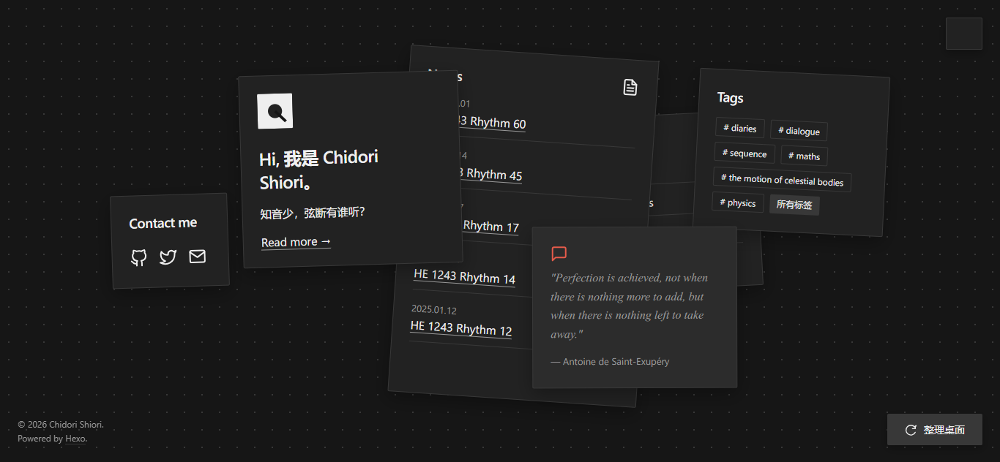

# Hexo Theme Desktop

A modernist, gridless, and interactive theme for Hexo.

[](https://hexo.io/)
[](https://github.com/FengIKUN/hexo-theme-desktop/blob/main/LICENSE)
[](https://github.com/FengIKUN/hexo-theme-desktop)



## Design Philosophy

传统的博客通常由死板的 `Header`、`Main` 和 `Footer` 组成，被严丝合缝的网格（Grid）所束缚。
**Desktop** 试图打破这种垂直的信息流。想象你的博客不是一个网页，而是一张宽阔的桌面：
你的文章、标签、名言和自我介绍，就像是一张张散落在桌子上的实体卡片。每一次刷新，卡片都会以略微不同的位置和角度随机散落；你可以用鼠标（或触屏）随意拿起、拖拽它们。

极少的圆角、克制的单色调、恰到好处的环境阴影、纯粹的矢量图——这是一款融合了现代主义与物理拟物化的极简主题。

## Features

- **无网格物理交互**：散落卡片式首页，支持鼠标和触屏的真实拖拽。拿起时阴影扩散、卡片放大，放下时赋予随机微小倾角。
- **丝滑 Dark Mode**：原生 CSS 变量支持，完美识别系统级偏好。防闪烁 (FOUC) 处理，切换顺滑。
- **原生 LaTeX 极速渲染**：抛弃前端 JS 解析带来的卡顿与闪烁。基于 `markdown-it-katex` 在服务端生成公式，配合优雅的横向滚动条。
- **“零”依赖，极速加载**：0 jQuery, 0 外部字体, 0 位图。所有图标均为内联纯手绘 SVG。
- **沉浸式内页**：聚焦于桌面中央的巨型卡片。优雅的版面留白。
- **全端适配**：动态计算视口边界不让卡片溢出屏幕边缘。


## Installation

1. 在你的 Hexo 博客根目录下，克隆本主题：
```bash
git clone https://github.com/yourname/hexo-theme-desktop.git themes/desktop
```
2. 打开 Hexo 根目录的 _config.yml，启用主题：
```yaml
theme: desktop
```
## Crucial Setup
由于 Hexo 默认的渲染引擎会破坏 LaTeX 公式中的下划线 _ 语法。为了实现本主题主打的 “服务端极速公式渲染”，你必须更换渲染器。
在你的 **Hexo 根目录** 下执行以下命令：
```bash
npm uninstall hexo-renderer-marked hexo-renderer-pandoc hexo-renderer-kramed

npm install hexo-renderer-markdown-it @iktakahiro/markdown-it-katex --save
```
然后，在 Hexo 根目录 的 _config.yml 底部追加以下配置：

```yaml
markdown:
  render:
    html: true
    xhtmlOut: false
    breaks: true
    linkify: true
    typographer: true
  plugins:
    - '@iktakahiro/markdown-it-katex'
```

现在，只需要在文章的 Front-matter 中添加 
```yaml
math: true
```
你的 `$...$` 与 `$$...$$` 公式就可以渲染啦。

## Configuration
你可以通过 themes/desktop/_config.yml 来定制桌面上显示的元素：
```yaml
# 桌面名言卡片
quote:
  text: "Perfection is achieved, not when there is nothing more to add, but when there is nothing left to take away."
  author: "Antoine de Saint-Exupéry"

# 社交链接卡片 (不需要的项可以直接删除)
social:
  GitHub: "https://github.com/yourname"
  Twitter: "https://twitter.com/yourname"
  Mail: "mailto:your@email.com"

# 头像设置 (支持填写图片 URL，留空则默认使用极简 SVG 几何头像)
avatar: ""
```
## Pages Creation
本主题内置了极简的 About 、Tags 和 Categories 独立卡片页面。你只需使用 Hexo 命令生成它们。
```bash
hexo new page about
hexo new page tags
hexo new page categories
```

## Customization
修改主题色：打开 `source/css/style.css`，在 `:root` 中找到 `--accent` 变量，修改它即可改变全站的强调色（默认是略带复古感的砖红色 `#D94A38`）。

修改头像：如果你想使用自己的照片代替主页的几何 SVG 头像，可以修改 `layout/index.ejs` 中的 `<svg>` 代码块，或者在其中加入 `" alt="avatar">` 即可。

## LICENSE
MIT &copy; 2026 Chidori Shiori.
